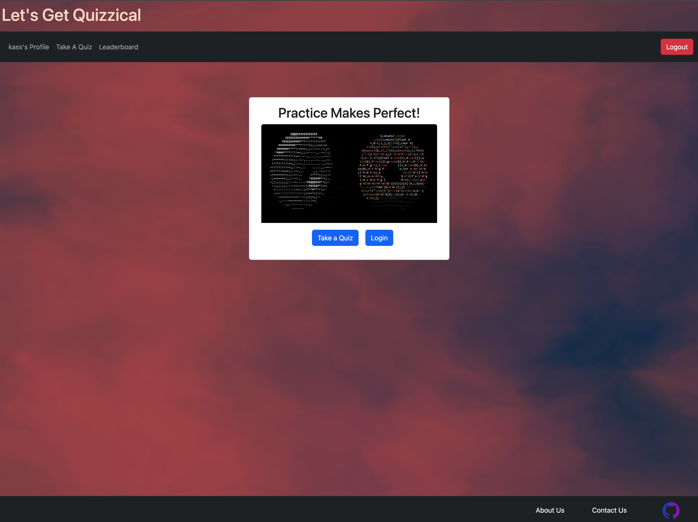

# Let's Get Quizzical

[Link to my project](https://young-fortress-52703.herokuapp.com/)

## Description

A React driven application created by students for students to practice coding exercises as they prepare for job interviews. Multiple categories are offered by the application so that students have a range of topics to study. Let's Get Quizzical allows users to view their progress from their profile page via ChartJs functionality. The Leaderboard organizes all existing user's scores and displays the best ones.

## Table of Contents

- [Technologies](#technologies)
- [Visuals](#visuals)
- [Contributing](#contributing)
- [License](#license)
- [Questions](#questions)

## Technologies

- React for front end
- GraphQL
- Node.js
- Express.js
- Mongoose and MongoDB
- Chart.js
- Vanta.js
- Bootstrap

## Visuals

- Landing Page

- Start Quiz

- Results Page

## Contributing

Listed are all members of the team and their linked GitHub accounts:

- [Daniel Bartolini](https://github.com/djbartolini)

- [Adam Queen](https://github.com/Smoke5643)

- [Sy Mont](https://github.com/Saidou25)

- [Kassandra Rojas](https://github.com/kassrojas)

## License

This project is licensed under the MIT.
For license notice, please click on the license badge at the top of this readme file or here: 

## Questions

If you have any other questions, please visit the app's [GitHub repository](https://github.com/kassrojas/quizQL).
